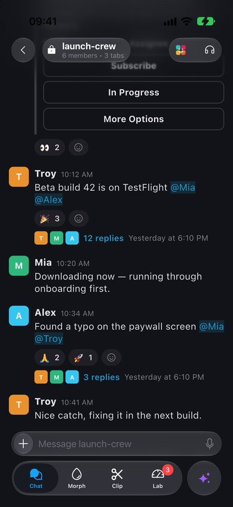
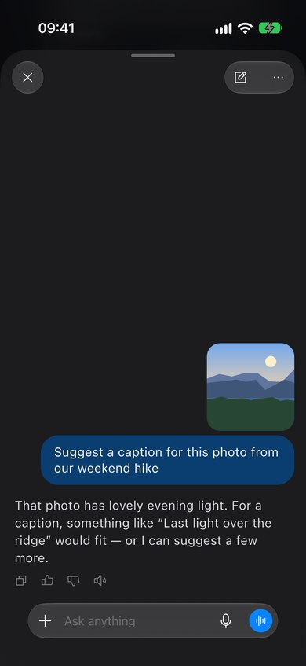
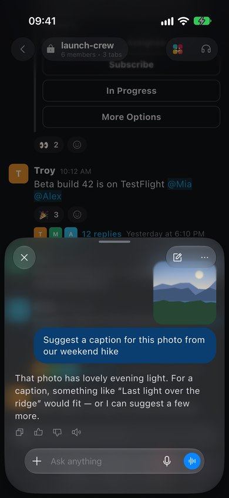
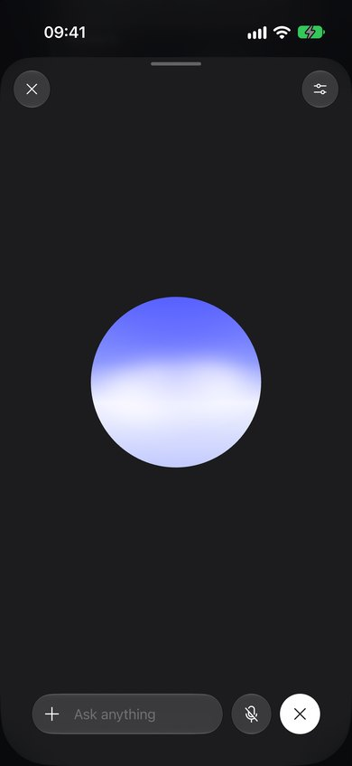
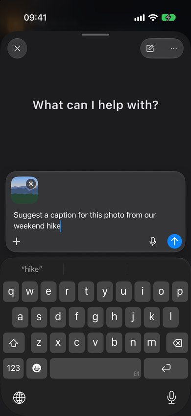
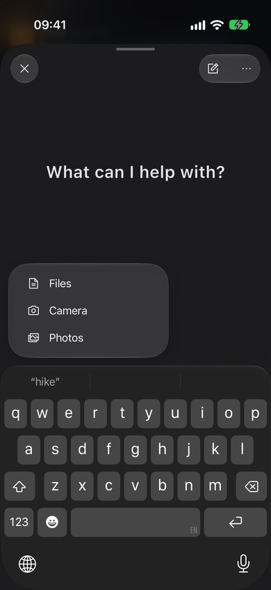
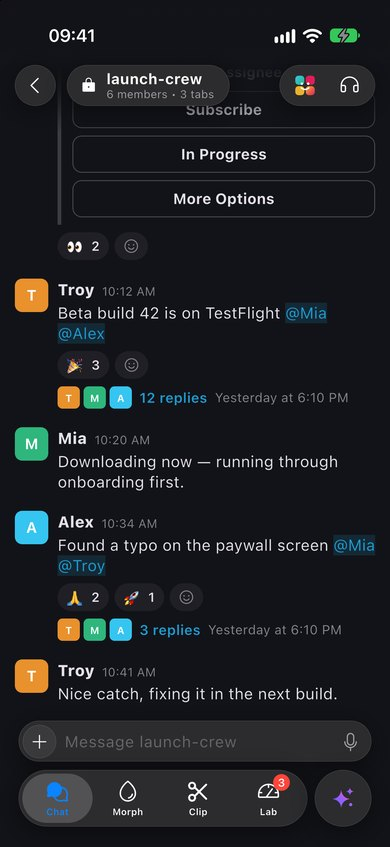
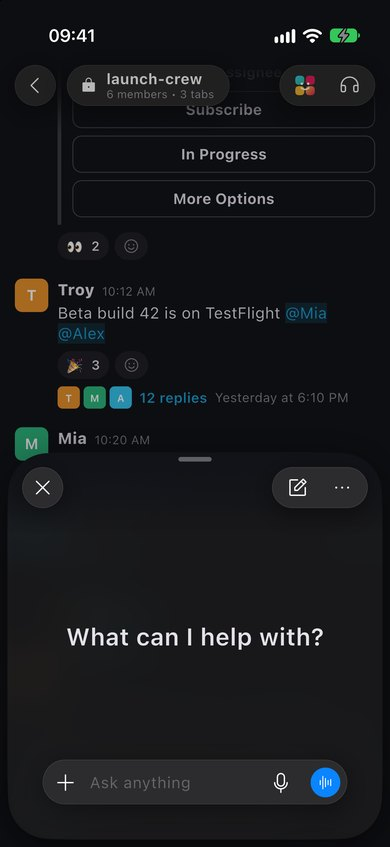

# Veneer

[](https://pub.dev/packages/veneer)
[](https://github.com/troyvnit/veneer/actions/workflows/ci.yml)
[](LICENSE)

**Real native iOS 26 UI for Flutter apps — Liquid Glass, UIKit bars, native composers and
sheets — driven by your Flutter widget tree, with matching Flutter UI on Android and older iOS.**

<p align="center">
  
  <br>
  <sub>The example app on the iOS 27 simulator, real time. <a href="https://github.com/troyvnit/veneer/raw/main/doc/demo.mp4">Full-quality video</a>.</sub>
</p>

<p align="center">
  
  
  
  
</p>

Veneer puts **one** native overlay above the Flutter surface and keeps it in sync with Flutter
layout every frame. The tab bar is a real `UITabBarController`, the navigation bar is a real
`UINavigationBar`, sheets are real `UISheetPresentationController` sheets, and glass is real
`UIGlassEffect` refracting your Flutter pixels, with UIKit's own animations, gestures and
accessibility. There are no platform views per widget, so separate glass widgets can merge and
morph into each other the way native glass does.

Everything is a regular Flutter widget. On iOS 26 and later it renders natively; on Android and
iOS 15–25 the same widget tree renders Flutter replicas with the same layout, sizes and
behaviour, so one codebase serves every platform.

> **Status: pre-release (0.1).** The API may still change. It has been verified on the iOS 26/27
> simulator and the Android emulator; real-device performance measurements are still to come.

## Contents

- [Features](#features)
- [Platform support](#platform-support)
- [Installation](#installation)
- [Quick start](#quick-start)
- [Components](#components)
  - [Tab bar](#tab-bar) · [Navigation bar](#navigation-bar) · [Composer](#composer) ·
    [Prompt composer](#prompt-composer) · [Sheets](#sheets) · [Menus](#menus) ·
    [Glass shapes](#glass-shapes) · [Icons](#icons)
- [Android and older iOS](#android-and-older-ios)
- [Limitations](#limitations)
- [Example app](#example-app)
- [How it works](#how-it-works)
- [Contributing](#contributing)
- [License](#license)

## Features

| | |
|---|---|
| **Tab bar** | A real `UITabBarController`: the floating Liquid Glass bar, selection morph, badges and the split layout's detached trailing button. Slides away when another screen covers it. |
| **Navigation bar** | A real `UINavigationBar` with glass bar buttons, a title capsule, grouped trailing buttons, native menus and iOS 26's scroll edge effect over Flutter content. |
| **Composer** | A messaging composer: a glass capsule that morphs into an expanded card above the keyboard, inside the keyboard's own animation, with interactive keyboard dismissal, mentions and Slack-style voice recording. |
| **Prompt composer** | An assistant-style composer: grows from a capsule into a card for long prompts and attachments, turns its voice button into send as you type, and splits glass buttons off for a voice session. |
| **Sheets** | Real UIKit sheets hosting Flutter content: detents, grabber, Liquid Glass at partial heights, the page behind receding — with Veneer's bars and composers inside. |
| **Menus** | Native `UIMenu`s from bar buttons, composer buttons and glass shapes, and UIKit context menus on long-pressed Flutter widgets. |
| **Glass shapes** | `UIGlassEffect` shapes laid out by Flutter, merging within groups, clipped by Flutter clips, interactive. |
| **Icons** | SF Symbols, any `IconData` (Material, Cupertino, custom and variable icon fonts), SVG and images — all rendered natively. |

## Platform support

| Platform | What renders |
|---|---|
| **iOS 26+** | The native layer: UIKit bars, sheets and composers, Liquid Glass, scroll edge effects |
| **iOS 15–25, Android** | Flutter replicas of the same UI, matching layout, sizes, positions, colours and corner radii, with solid surfaces instead of glass |
| Web, desktop | Not supported (the bridge uses `dart:ffi`) |

`Veneer.isSupported` tells you which path is active. You rarely need it: every widget picks
its own path, so app code needs no `Platform.isIOS` checks.

## Installation

```bash
flutter pub add veneer
```

Or track the repository directly:

```yaml
dependencies:
  veneer:
    git:
      url: https://github.com/troyvnit/veneer.git
      ref: main
```

Requirements:

- Flutter 3.47 or later (Dart 3.13).
- iOS deployment target **15.0** or later. The native layer turns on at runtime on iOS 26+.
  Build with Xcode 26 or later so the iOS 26 SDK is available.
- Works with CocoaPods and Swift Package Manager. No Android setup.

## Quick start

Wrap your pages in a `NativeChromeScope` for the tab bar, and register the navigator
observer so native chrome steps aside for Flutter dialogs and bottom sheets:

```dart
import 'package:veneer/veneer.dart';

class App extends StatelessWidget {
  const App({super.key});

  @override
  Widget build(BuildContext context) => MaterialApp(
    navigatorObservers: [VeneerNavigatorObserver()],
    home: const Home(),
  );
}

class Home extends StatefulWidget {
  const Home({super.key});

  @override
  State<Home> createState() => _HomeState();
}

class _HomeState extends State<Home> {
  int _tab = 0;

  @override
  Widget build(BuildContext context) => NativeChromeScope(
    tabs: const [
      NativeTabItem(title: 'Home', icon: NativeIcon.symbol('house'), selectedIcon: NativeIcon.symbol('house.fill')),
      NativeTabItem(title: 'Inbox', icon: NativeIcon.symbol('tray'), badge: '3'),
    ],
    selectedIndex: _tab,
    onTabSelected: (i) => setState(() => _tab = i),
    child: IndexedStack(index: _tab, children: const [HomePage(), InboxPage()]),
  );
}
```

Pages add a navigation bar by wrapping their content. Content gets `MediaQuery` padding for the
bars, so it starts below them and scrolls underneath:

```dart
class InboxPage extends StatelessWidget {
  const InboxPage({super.key});

  @override
  Widget build(BuildContext context) => Scaffold(
    body: NativeNavigationBar(
      title: const NativeBarTitle(title: 'Inbox'),
      trailing: [NativeBarButton(icon: const NativeIcon.symbol('square.and.pencil'), title: 'New', onPressed: () {})],
      child: Builder(
        builder: (context) => ListView(padding: MediaQuery.paddingOf(context), children: const [/* … */]),
      ),
    ),
  );
}
```

## Components

### Tab bar

```dart
NativeChromeScope(
  tabs: const [
    NativeTabItem(title: 'Chat', icon: NativeIcon.symbol('bubble.left'), selectedIcon: NativeIcon.symbol('bubble.left.fill')),
    NativeTabItem(title: 'Library', icon: NativeIcon.icon(Icons.photo_library_outlined), badge: '3'),
  ],
  trailingAction: NativeTabAction(icon: NativeIcon.symbol('sparkles'), title: 'Assistant', onPressed: openAssistant),
  scrollEdgeEffect: NativeScrollEdgeEffect.soft,
  selectedIndex: index,
  onTabSelected: (i) => setState(() => index = i),
  child: pages,
)
```

- A real `UITabBarController`, so the glass bar, selection animation, badges, VoiceOver and the
  large content viewer are UIKit's. Icons, titles and badges update in place.
- **Split layout:** `trailingAction` becomes the detached glass button at the trailing edge. It
  acts as a button by default; with `selectable: true` it's a tab reported as index `tabs.length`.
- Up to **5 items** including the trailing button (UIKit's limit on iPhone before a "More" tab).
- Slides away while another route covers its page, and while a Flutter popup shows (with
  `VeneerNavigatorObserver`).

### Navigation bar

```dart
NativeNavigationBar(
  leading: NativeBarButton(icon: const NativeIcon.symbol('chevron.left'), title: 'Back', onPressed: pop),
  title: NativeBarTitle(title: 'launch-crew', subtitle: '6 members', icon: const NativeIcon.symbol('lock.fill'), capsule: true),
  trailing: [
    NativeBarButton(icon: const NativeIcon.symbol('headphones'), title: 'Huddle', onPressed: huddle),
    NativeBarButton(icon: const NativeIcon.symbol('ellipsis'), title: 'More', menu: moreItems),
  ],
  child: page,
)
```

- A real `UINavigationBar`: 44 pt glass buttons, and adjacent trailing buttons sharing one glass
  capsule. When its buttons change, UIKit morphs the glass between the old and new sets.
- `NativeBarTitle(capsule: true)` shows a tappable glass capsule with an icon, title,
  subtitle and optional `accessory` (such as a chevron), like a channel header; otherwise a
  plain title, centred or leading (`alignment: NativeBarTitleAlignment.leading`). With
  `fill: true` the capsule spans the space between the buttons (a chat header), and `iconSize`
  fits an avatar-sized icon such as a group avatar. Pass `style`
  and `subtitleStyle` to use your app's fonts and colours; the native bar loads the font
  family from your Flutter assets.
- Bar buttons can show a `badge` (a count, text, or `''` for a dot), use `prominent` tinted
  glass, show text instead of an icon, and split into separate capsules with `group`.
- **Scroll edge effect:** content dissolves into iOS 26's own progressive blur under the bar
  (`scrollEdgeEffect`, soft by default).
- Shown while its page is visible; the most recently shown bar wins.

### Composer

A messaging composer for chat screens:

```dart
NativeComposer(
  controller: composer,
  placeholder: 'Message launch-crew',
  leading: NativeComposerButton(icon: const NativeIcon.symbol('plus'), title: 'Attach', onPressed: attach),
  idleAction: NativeComposerButton(icon: const NativeIcon.symbol('mic'), title: 'Voice message'),
  toolbar: [
    NativeComposerButton(icon: const NativeIcon.symbol('textformat'), title: 'Formatting'),
    NativeComposerButton(icon: const NativeIcon.symbol('face.smiling'), title: 'Emoji'),
  ],
  onSend: send,
  child: ListView(reverse: true, children: messages),
)
```

- Idle, a 44 pt glass capsule above the tab bar. Focused, it morphs into a card above the
  keyboard with a toolbar row and send button, inside the keyboard's own animation.
- The text view grows to `maxLines`, then scrolls. `NativeComposerController` reads and sets
  the text and focus.
- **Interactive keyboard dismissal:** dragging the content down pulls the keyboard with the
  finger, using UIKit's own mechanism, while Flutter keeps scrolling.
- Use it in a `Scaffold(resizeToAvoidBottomInset: false)`: it handles the keyboard and pads
  `child` for the space it takes.
- **Mentions:** `controller.selection` follows the caret, `controller.replaceRange(start, end,
  '@Name ')` completes the mention being typed, and `highlights: ['@Name']` draws mentions in
  the tint colour.
- **Voice recording** (both composers), as in Slack:

  ```dart
  NativePromptComposer(
    controller: composer,
    actions: [
      NativeComposerButton(
        icon: const NativeIcon.symbol('mic'),
        title: 'Record',
        onPressed: () => composer.startVoiceRecording(maxDuration: const Duration(minutes: 5)),
      ),
    ],
    onVoiceRecorded: (clip) => attach(clip.path, clip.duration),
    onVoiceRecordingFailed: (reason) => recordWithFlutter(),
    recordingCancelLabel: 'Cancel',
    recordingDoneLabel: 'Done',
    child: conversation,
  )
  ```

  The composer becomes a recording bar with cancel, a live waveform, the elapsed time and done.
  Recording is native: an AAC `.m4a` file in the temporary directory, which your app owns from
  then on. Your app needs an `NSMicrophoneUsageDescription`. The Flutter fallback reports
  `NativeVoiceRecordingFailure.unavailable`.

### Prompt composer

An assistant-style composer:

<p>
  
  
</p>

```dart
NativePromptComposer(
  controller: composer,
  placeholder: 'Ask anything',
  leading: NativeComposerButton(icon: const NativeIcon.symbol('plus'), title: 'Add', menu: [
    NativeMenuItem(title: 'Photos', icon: const NativeIcon.symbol('photo.on.rectangle'), onSelected: pickPhoto),
    NativeMenuItem(title: 'Files', icon: const NativeIcon.symbol('doc'), onSelected: pickFile),
  ]),
  actions: [NativeComposerButton(icon: const NativeIcon.symbol('mic'), title: 'Dictate', onPressed: dictate)],
  primaryAction: NativeComposerButton(
    icon: const NativeIcon.symbol('waveform'),
    title: 'Voice mode',
    onPressed: () => setState(() => voice = true),
  ),
  sideActions: [
    NativeComposerButton(icon: const NativeIcon.symbol('mic.slash'), title: 'Mute', onPressed: toggleMute),
    NativeComposerButton(
      icon: const NativeIcon.symbol('xmark'),
      title: 'End',
      prominent: true,
      onPressed: () => setState(() => voice = false),
    ),
  ],
  showSideActions: voice,
  attachments: [
    NativeComposerAttachment(id: 'p1', thumbnail: NativeIcon.imageFile(photoPath), onRemove: () => remove('p1')),
  ],
  onSend: send,
  child: conversation,
)
```

- **One line (48 pt):** leading button, text, inline actions and a filled circle that shows
  `primaryAction` while empty and becomes **send** once there's text or an attachment.
- **Multi-line:** when the text wraps, has a line break or there are attachments, the capsule
  grows into a card with attachments on top and the buttons on a bottom row.
- **Side actions:** glass circles that split off the capsule like liquid while
  `showSideActions` is true (for example a voice session's mute and end buttons).
- **Attachments:** image tiles (no `title`) or file chips, with remove buttons; `loading`
  dims a tile and shows a spinner while it uploads.
- **States:** `stopAction` replaces the circle while a reply is generating, `sendEnabled` and
  `sendBusy` hold or spin the send button, and `editable: false` shows text (such as a live
  transcript) without taking the keyboard.
- Idle, it sits concentric with the display's corners; focused, it rides the keyboard.

### Sheets

Real UIKit sheets for Flutter content:

<p>
  
  
</p>

```dart
// main.dart: the sheet's Flutter app
@pragma('vm:entry-point')
void assistantSheet() => runNativeSheet(
  MaterialApp(theme: appTheme, home: const AssistantPage()),
);

// Warm it up early so the sheet opens with content:
NativeSheet.prewarm('assistantSheet');

// Present it:
showNativeSheet<void>(
  context: context,
  entrypoint: 'assistantSheet',
  detents: const [NativeSheetDetent.medium, NativeSheetDetent.large],
  initialDetent: NativeSheetDetent.large,
  builder: (context) => const AssistantPage(), // Android / iOS 15–25
);

// Inside the sheet:
NativeSheet.close(context, result);
```

- On iOS 26 this presents a `FlutterViewController` as a `.pageSheet`, so detents, the grabber,
  drag physics, dimming, the corner radius, Liquid Glass at partial heights and the page behind
  receding are all UIKit's.
- A Flutter engine renders into one view at a time, so the sheet runs **its own engine**,
  started at `entrypoint` (a top-level function in `main.dart`, or in `libraryUri`) and
  spawned from a shared `FlutterEngineGroup`, which shares compiled code and the GPU context.
  After a sheet closes, the next engine is warmed automatically.
- The sheet's isolate doesn't share state with your app: pass a `payload` in (read it with
  `NativeSheet.payload()`; pre-warmed engines receive it when presented) and return a result
  with `NativeSheet.close`. `arguments` reach the entrypoint instead, but bypass pre-warming.
- Sheet engines never restyle the app's status bar, and each engine is torn down when its
  sheet is dismissed.
- A sheet's engine can call `showNativeSheet` itself: the new sheet is presented natively over
  it, and goes away with it.
- For a `NativeSheetDetent.content()` detent, wrap the sheet's content in `NativeSheetContent`:
  UIKit sizes the sheet to it.
- Inside, a `NativeNavigationBar` is a real `UINavigationBar` placed per Apple's sheet
  templates (16 pt from the sheet's edges), and composers ride the sheet natively. Pulling down
  drags the sheet when the content under the finger is at its top edge; otherwise the content
  scrolls, as in UIKit.
- Give the sheet page's `Scaffold` a transparent background so the sheet's material shows.
- Without an `entrypoint`, or off iOS 26, `builder` runs in a Flutter sheet with the same
  detents, grabber, iOS 26 look and drag physics. `NativeSheetRoute` pushes that Flutter sheet
  directly, and `NativeSheetDetent.content()` sizes it to its content (native sheets use large).
- The sheet's content gets the safe area a UIKit sheet gives it: the top clears the grabber, the
  bottom clears the home indicator, and the keyboard moves the sheet to its largest detent.

### Menus

```dart
NativeBarButton(
  icon: const NativeIcon.symbol('ellipsis'),
  title: 'More',
  menu: [
    NativeMenuItem(title: 'Share', icon: const NativeIcon.symbol('square.and.arrow.up'), onSelected: share),
    NativeMenuItem(title: 'Delete', icon: const NativeIcon.symbol('trash'), destructive: true, onSelected: delete),
  ],
)
```

`menu` on `NativeBarButton`, `NativeComposerButton` and `GlassShape` opens a native `UIMenu` that
grows out of the button. `NativeMenuItem.divider()` separates sections. Off iOS 26 a Flutter
menu with iOS metrics opens instead.

**Context menus** on any Flutter widget:

```dart
NativeContextMenu(
  borderRadius: BorderRadius.circular(18),
  items: [
    NativeMenuItem(title: 'Reply', icon: const NativeIcon.symbol('arrowshape.turn.up.left'), onSelected: reply),
    NativeMenuItem(title: 'Delete', icon: const NativeIcon.symbol('trash'), destructive: true, onSelected: delete),
  ],
  child: bubble,
)
```

A long press opens UIKit's context menu. The widget lifts over a blurred backdrop, with the
press shrink, haptics and the settle back. UIKit recognizes the press on the Flutter view against
where Flutter laid the widget out that frame, so it follows scrolling, and a press that moves
still scrolls. The preview is a snapshot of the widget clipped to `borderRadius`. Off iOS 26 a
long press opens the Flutter menu next to the widget.

### Glass shapes

```dart
Stack(children: [
  ListView(children: [for (final item in items) GlassShape(height: 56, label: item.name, icon: item.icon)]),
  GlassGroup(
    zIndex: 1,
    child: Row(children: [
      GlassShape(width: 56, height: 56, icon: const NativeIcon.symbol('plus'), onTap: add),
      GlassShape(width: 56, height: 56, icon: const NativeIcon.symbol('ellipsis'), menu: moreItems),
    ]),
  ),
])
```

- `GlassShape` is native `UIGlassEffect` positioned by Flutter layout every frame; its content
  (icon, label) is native too. With `onTap` it uses UIKit's interactive glass response.
- Shapes in the same `GlassGroup` merge within the group's spacing and morph out of their
  neighbours. Groups stack by `zIndex`; shapes outside a group join their route's group.
- Glass honours Flutter clips (`ClipRect`, `ClipRRect`, `ClipOval`, scroll viewports).
- Glass always draws above Flutter content: Flutter widgets placed under a shape are refracted by it.

### Icons

Every icon parameter takes a `NativeIcon`, rendered natively:

| | |
|---|---|
| `NativeIcon.symbol('heart.fill')` | SF Symbol |
| `NativeIcon.icon(Icons.add)` | Any `IconData`: Material, Cupertino, package or custom icon fonts, and variable fonts (`fill`, `weight`, `grade`, `opticalSize`) |
| `NativeIcon.svgAsset('assets/x.svg')`, `.svgFile(path)`, `.svg(markup)` | SVG, drawn by Veneer's native renderer (CSS, gradients, clip paths, masks, `use`, text…) |
| `NativeIcon.image('assets/photo.jpg')`, `.imageFile(path)` | Raster images in their own colours |

Glyphs and SVGs are template images that tint like SF Symbols; pass `tinted: false` to keep an
SVG's own colours. Release builds tree-shake icon fonts down to the `const` `IconData`s you use,
as with `Icon`. Off iOS 26, SF Symbols map to close Material icons (override with
`NativeIcon.symbol(name, fallback: …)`).

## Android and older iOS

Where the native layer isn't available, every widget renders a Flutter replica with the
native layout, sizes, positions and corner radii, iOS system colours, and solid surfaces
instead of glass. It follows light and dark mode.

<p>
  
  
</p>

To preview the replicas on an iOS 26 device, set `Veneer.debugForceFallback = true` before
`runApp`. Wrap any subtree in `VeneerFallbackScope` to force its replicas.

To match your design system, add a `VeneerFallbackStyle` to your theme's `extensions` (one per
brightness); the replicas read their surfaces, labels, accent, badge colours and shadows from it:

```dart
ThemeData(extensions: [
  VeneerFallbackStyle.iosLight.copyWith(accent: brand, surface: card, shadows: brandShadow),
])
```

A Flutter sheet given a `backgroundColor` stays solid at every detent; pass a
`CupertinoDynamicColor` to have it follow light and dark mode while it's open.

## Limitations

- **Z-order:** native glass and chrome always draw above Flutter content, so their content has
  to be native. Flutter popups are handled (chrome steps aside); arbitrary `Overlay`s aren't.
- **Clips:** one rounded clip per shape is exact; `ClipPath` counts as its bounding box. Shapes
  under different clips don't merge. Opaque Flutter widgets painted over glass don't hide it.
- **Route transitions:** the tab bar slides away under pushed routes, but the navigation bar
  and composer switch at the start of a push instead of sliding with the page.
- **Sheets:** the sheet's Flutter content runs in its own isolate (see [Sheets](#sheets)).
- **Gestures:** a touch that starts on an interactive glass shape belongs to UIKit and can't
  start a Flutter scroll.
- **Context menus:** the lifted preview is a still snapshot, so animated content freezes while
  the menu is up.
- **Accessibility:** not yet audited with VoiceOver.
- **Not yet native:** toolbars, search, and leaf controls such as switches and sliders.

## Example app

The [example](example) is a small messaging app that exercises every component:

```bash
cd example
flutter run
```

- **Chat:** a channel with the native navigation bar, scroll edge effect and composer.
- **AI button** (tab bar): an assistant in a native sheet with the prompt composer, attachments,
  voice mode and native menus.
- **Morph, Clip:** merging glass groups and glass inside Flutter clips.
- **Lab:** icon types, the sync-lag test and native stats.

Launch with `-VENEER_FALLBACK 1` to see the Android / iOS 15–25 UI on an iOS 26 simulator. The
example's icons are [Phosphor Icons](https://phosphoricons.com) (MIT), compiled into an icon
font by `example/tool/icon_font/build_icon_font.py`.

## How it works

Veneer adds one transparent native view above the `FlutterView`. Flutter widgets register
anchors; once per frame, after Flutter lays out and paints, Veneer collects every anchor's
rect, visibility and clip and hands them to UIKit in a single synchronous `dart:ffi` call, so
native views move in the same frame as the Flutter pixels under them. Bars, composers and
sheets are UIKit components configured from Dart. Touches pass through to Flutter except where
they land on native controls.

See [doc/architecture.md](doc/architecture.md) for the design, the per-frame path, measured
results and the rules learned along the way.

## Contributing

Issues and pull requests are welcome. CI runs format, analysis and tests on every pull
request. Before sending a change:

```bash
flutter analyze && flutter test
cd example && flutter analyze
cd ios && xcodebuild test -workspace Runner.xcworkspace -scheme Runner \
  -destination 'platform=iOS Simulator,name=iPhone 17' -only-testing:RunnerTests
```

## License

MIT — see [LICENSE](LICENSE).
